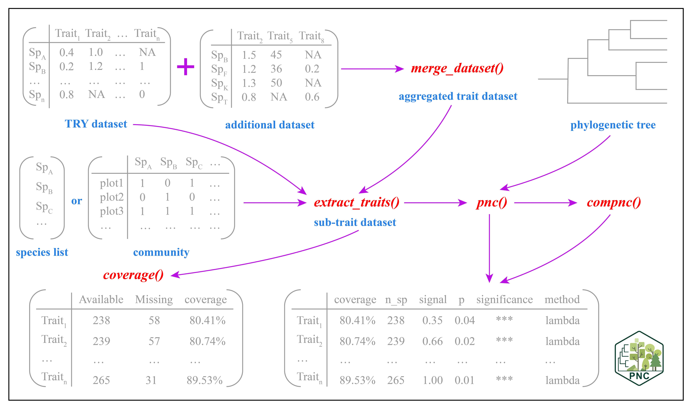

# PNC

## Installation

### From CRAN (recommended)

```{r,class.source = 'fold-show'}
# install.packages("PNC")
```

### From GitHub (development version)

```{r,class.source = 'fold-show'}
# if (!requireNamespace("devtools", quietly = TRUE)) {install.packages("devtools")}
# devtools::install_github("biodiversity-monitoring/PNC")
```

## Main functions of PNC and their descriptions

| Name                     | Type     | Description                                                                                                                                                                                                                                                                         |
|----------|----------|-----------------------------------------------------|
| **AmphiBIO**             | Database | A comprehensive global database of amphibian natural history traits. It provides 12 continuous traits related to ecology, morphology, and reproduction for over 6,500 species across all orders (Anura, Caudata, Gymnophiona), 61 families, and 531 genera (Oliveira et al., 2017). |
| **AVONET**               | Database | A comprehensive trait database for extant avian species, providing detailed morphological information through 11 continuous traits covering 11,009 bird species worldwide (Tobias et al., 2022).                                                                                    |
| **BCI**                  | Database | A 50-hectare forest ecosystem dataset from Barro Colorado Island, comprising comprehensive species inventories, phylogenetic trees at species and genus levels, and community composition matrices (Condit et al., 2019).                                                           |
| **COMBINE**        | Database | An integrated mammalian trait database consolidating 40 continuous morphological and ecological traits for 6,234 extant and recently extinct mammal species (Soria et al., 2021).                                                                                                   |
| **Fishlife**             | Database | A comprehensive compilation of life-history traits for described fish species (Chondrichthyes and Osteichthyes), featuring 17 continuous traits with at least one measurement for 26,622 species (Thorson et al., 2023).                                                            |
| **HimalayanBirds**       | Database | A dataset providing information on bird species in the Himalayas, including species names, phylogenetic relationships, and community composition across elevation bands (Ding et al., 2021).                                                                                        |
| **ReptTraits**           | Database | A comprehensive reptilian trait dataset comprising 8 continuous morphological and ecological traits across 12,060 species spanning major reptilian clades (Crocodylia, Testudines, Rhynchocephalia, Amphisbaenia, Sauria, and Serpentes) (Oskyrko et al., 2024).                    |
| **TRY**                  | Database | A global plant trait database providing species-level datasets with 20 continuous traits widely utilized in ecological and evolutionary research (Kattge et al., 2020).                                                                                                             |
| **`merge_species_df()`** | function | Merges two data frames based on the "species" column, automatically handling missing values and inconsistent columns.                                                                                                                                                               |
| **`extract_traits()`**   | function | Extracts trait data at the species, genus, or family level from global trait databases.                                                                                                                                                                                             |
| **`coverage()`**         | function | Provides statistics on trait availability, including the number of missing values and coverage rates.                                                                                                                                                                               |
| **`pnc()`**              | function | Performs a phylogenetic niche conservatism analysis within a single community, quantifying the phylogenetic signal in trait data. Optional PCA dimensionality reduction and multiple statistical approaches are supported.                                                          |
| **`compnc()`**           | function | Conducts a comprehensive phylogenetic niche conservatism analysis across multiple communities, similar in function to `pnc()`.                                                                                                                                                      |

## PNC workflow



Work in progress...

## Reference

Condit, R., Perez, R., Aguilar, S., Lao, S., Foster, R., Hubbell, S.P. (2019). Complete data from the Barro Colorado 50-ha plot: 423617 trees, 35 years, 2019 version. <https://doi.org/10.15146/5xcp-0d46>

Ding, Z., Hu, H., Cadotte, M.W., Liang, J., Hu, Y., & Si, X. (2021). Elevational patterns of bird functional and phylogenetic structure in the central Himalaya. Ecography, 44(9), 1403-1417. <https://doi.org/10.1111/ecog.05660>

Kattge, J., Bönisch, G., Díaz, S., Lavorel, S., Prentice, I. C., Leadley, P., Tautenhahn, S., Werner, G. D. A., Aakala, T., Abedi, M., Acosta, A. T. R., Adamidis, G. C., Adamson, K., Aiba, M., Albert, C. H., Alcántara, J. M., Alcázar C, C., Aleixo, I., Ali, H., Amiaud, B., et al. (2020). TRY plant trait database -- enhanced coverage and open access. Global Change Biology, 26(1), 43-60. <https://doi.org/10.1111/gcb.14904>

Oliveira, B. F., São-Pedro, V. A., Santos-Barrera, G., Penone, C., & Costa, G. C. (2017). AmphiBIO, a global database for amphibian ecological traits. Scientific data, 4(1), 1-7. <https://doi.org/10.1038/sdata.2017.123> 

Oskyrko, O., Mi, C., Meiri, S., & Du, W. (2024). ReptTraits: a comprehensive dataset of ecological traits in reptiles. Scientific Data, 11(1), 243. <https://doi.org/10.1038/s41597-024-03079-5>

Soria, C. D., Pacifici, M., Di Marco, M., Stephen, S. M., & Rondinini, C. (2021). COMBINE: a coalesced mammal database of intrinsic and extrinsic traits. Ecology, 102(6), e03344. https://doi.org/10.1002/ecy.3344

Thorson, J. T., Maureaud, A. A., Frelat, R., Mérigot, B., Bigman, J. S., Friedman, S. T., Palomares, M. L. D., Pinsky, M. L., Price, S. A., & Wainwright, P. (2023). Identifying direct and indirect associations among traits by merging phylogenetic comparative methods and structural equation models. Methods in Ecology and Evolution, 14(5), 1243-1255. <https://doi.org/10.1111/2041-210X.14076>

Tobias, J. A., Sheard, C., Pigot, A. L., Devenish, A. J. M., Yang, J., Sayol, F., Neate-Clegg, M. H. C., Alioravainen, N., Weeks, T. L., Barber, R. A., Walkden, P. A., MacGregor, H. E. A., Jones, S. E. I., Vincent, C., Phillips, A. G., Marples, N. M., Montaño-Centellas, F. A., Leandro-Silva, V., Claramunt, S., Darski, B., et al. (2022). AVONET: morphological, ecological and geographical data for all birds. Ecology Letters, 25(3), 581-597. <https://doi.org/10.1111/ele.13898>
