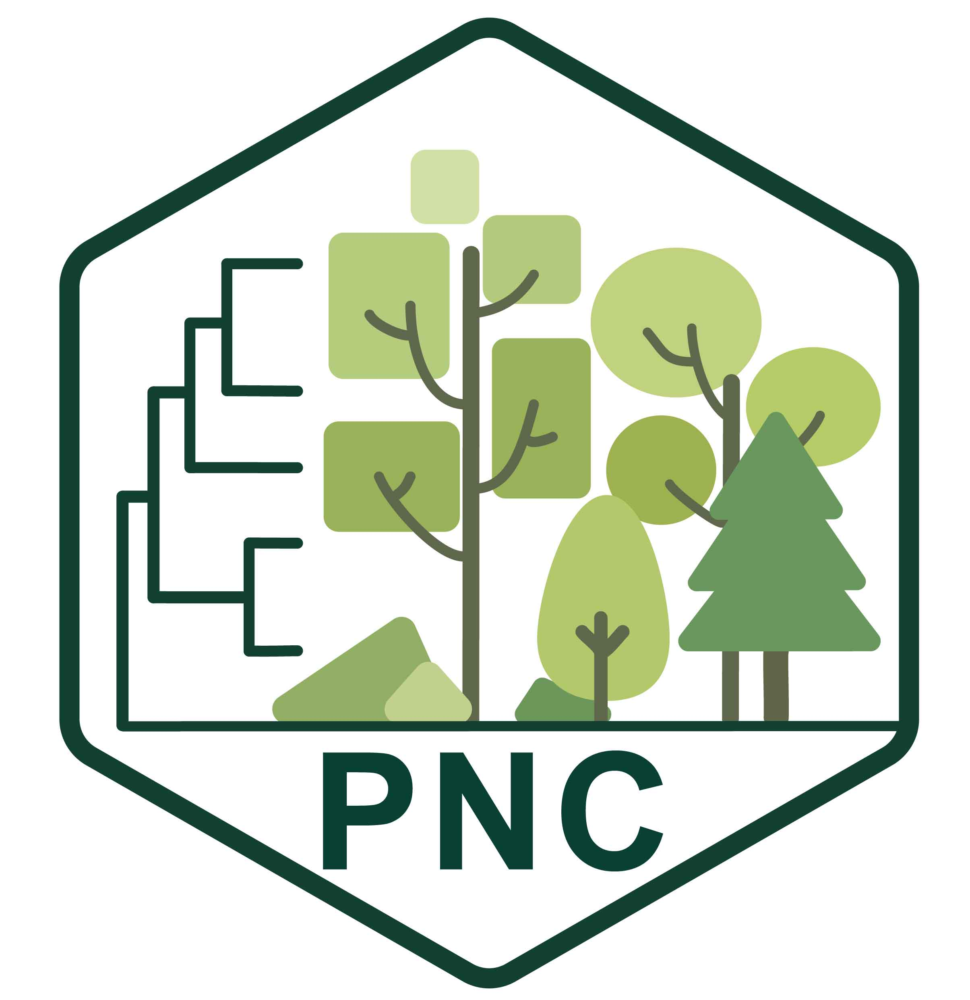

# PNC

## Installation

### From CRAN (recommended)

```{r,class.source = 'fold-show'}
# install.packages("PNC")
```

### From GitHub (development version)

```{r,class.source = 'fold-show'}
# if (!requireNamespace("devtools", quietly = TRUE)) {install.packages("devtools")}
# devtools::install_github("biodiversity-monitoring/PNC")
```

## PNC workflow


Work in progress...
