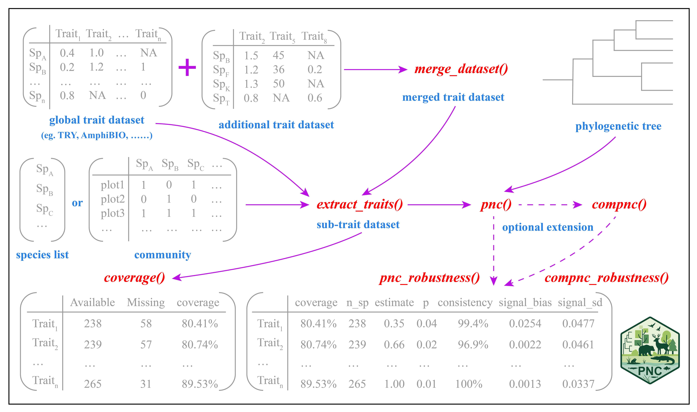

# PNC 

**PNC** is an R package for evaluating phylogenetic signal in niche-related functional traits within ecological communities. It provides a standardized workflow for assembling trait data, assessing trait coverage, estimating phylogenetic signal, comparing signal across communities, and evaluating the sensitivity of Pagel's lambda inference to incomplete trait data.

Phylogenetic signal in ecologically relevant traits is an important empirical prerequisite when phylogeny is used as a proxy for ecological similarity. PNC is designed to make this prerequisite easier to examine transparently across single or multiple communities.

## Installation

### From CRAN

```r
install.packages("PNC")
```

### From GitHub

```r
# install.packages("devtools")
devtools::install_github("biodiversity-monitoring/PNC")
```

## Main datasets and functions

| Name | Type | Description |
|---|---|---|
| **AmphiBIO** | Database | Global amphibian trait data covering ecological, morphological, and reproductive traits (Oliveira et al., 2017). |
| **AVONET** | Database | Global morphological, ecological, and geographical trait data for extant bird species (Tobias et al., 2022). |
| **BCI** | Database | Community composition and phylogenetic data from the 50-ha Barro Colorado Island forest plot (Condit et al., 2019). |
| **COMBINE** | Database | Integrated mammalian trait database covering extant and recently extinct species (Soria et al., 2021). |
| **Fishlife** | Database | Global compilation of fish life-history traits (Thorson et al., 2023). |
| **HimalayanBirds** | Database | Himalayan bird community composition and phylogenetic data across elevation bands (Ding et al., 2021). |
| **ReptTraits** | Database | Global reptile trait database covering major reptilian clades (Oskyrko et al., 2024). |
| **TRY** | Database | Global plant functional trait data used widely in functional ecology (Kattge et al., 2020). |
| **`merge_dataset()`** | Function | Merges trait datasets using species names while handling missing values and overlapping columns. |
| **`extract_traits()`** | Function | Extracts selected traits for specified taxa at species, genus, or family level. |
| **`coverage()`** | Function | Summarizes trait availability, including missing values and coverage rates. |
| **`pnc()`** | Function | Estimates phylogenetic signal for traits within a single species pool using Pagel's lambda and/or Blomberg's K, with optional PCA. |
| **`compnc()`** | Function | Extends `pnc()` across multiple communities using a common analytical workflow and, when requested, a common PCA space. |
| **`pnc_robustness()`** | Function | Evaluates the sensitivity of Pagel's lambda inference to the observed pattern of incomplete trait data using paired simulations. |
| **`compnc_robustness()`** | Function | Extends the missing-data sensitivity analysis across multiple communities. |

## PNC workflow



The workflow has four main steps:

1. **Prepare trait data** by extracting traits from the included databases or merging user-provided data.
2. **Assess data coverage** before phylogenetic analysis.
3. **Estimate phylogenetic signal** for individual traits and, optionally, PCA axes using `pnc()` or `compnc()`.
4. **Evaluate missing-data sensitivity** for the original traits using `pnc_robustness()` or `compnc_robustness()`.

## Case study 1: BCI plant community

The BCI example illustrates phylogenetic signal analysis at both species and genus levels.

```r
library(PNC)

data("BCI")
data("TRY")

plant_traits <- c(
  "LA",
  "LMA",
  "LeafN",
  "PlantHeight",
  "SeedMass",
  "SSD"
)

# Species level
species <- colnames(BCI$com)

traits_species <- extract_traits(
  species,
  TRY,
  rank = "species",
  traits = plant_traits
)

coverage(traits_species)

pnc_species <- pnc(
  trait_data = traits_species,
  phylo_tree = BCI$phy_species,
  methods = "lambda",
  pca_axes = c("PC1", "PC2")
)

set.seed(123)

robustness_species <- pnc_robustness(
  trait_data = traits_species,
  phylo_tree = BCI$phy_species,
  n_simulations = 100
)

# Genus level
genera <- unique(BCI$splist$genus)
genera <- genera[!is.na(genera)]

traits_genus <- extract_traits(
  genera,
  TRY,
  rank = "genus",
  traits = plant_traits
)

coverage(traits_genus)

pnc_genus <- pnc(
  trait_data = traits_genus,
  phylo_tree = BCI$phy_genus,
  methods = "lambda",
  pca_axes = c("PC1", "PC2")
)

set.seed(123)

robustness_genus <- pnc_robustness(
  trait_data = traits_genus,
  phylo_tree = BCI$phy_genus,
  n_simulations = 100
)
```

## Case study 2: Himalayan bird communities

The Himalayan example illustrates analyses of a pooled species set and of multiple local communities distributed across an elevational gradient.

```r
data("HimalayanBirds")
data("AVONET")

species <- colnames(HimalayanBirds$com)

bird_traits <- extract_traits(
  species,
  AVONET,
  rank = "species"
)

coverage(bird_traits)

# Pooled Himalayan species set
bird_pnc <- pnc(
  trait_data = bird_traits,
  phylo_tree = HimalayanBirds$phy_species,
  methods = "lambda",
  pca_axes = c("PC1", "PC2")
)

set.seed(123)

bird_robustness <- pnc_robustness(
  trait_data = bird_traits,
  phylo_tree = HimalayanBirds$phy_species,
  n_simulations = 100
)

# Multiple elevation-band communities
bird_multicom <- compnc(
  com = HimalayanBirds$com,
  trait_data = bird_traits,
  phylo_tree = HimalayanBirds$phy_species,
  methods = "lambda",
  pca_axes = c("PC1", "PC2")
)

set.seed(123)

bird_multicom_robustness <- compnc_robustness(
  com = HimalayanBirds$com,
  trait_data = bird_traits,
  phylo_tree = HimalayanBirds$phy_species,
  n_simulations = 100
)
```

## Interpreting the output

The main phylogenetic-signal functions report:

- `coverage`: percentage of taxa in the relevant species pool with trait data available for analysis;
- `n_sp`: number of taxa actually included in the trait-specific phylogenetic signal analysis after matching trait data with the phylogeny;
- `signal`: estimated Pagel's lambda or Blomberg's K;
- `p`: P value associated with the phylogenetic signal estimate;
- `significance`: significance category;
- `method`: phylogenetic signal metric used.

For `compnc()`, the output additionally reports:

- `plot`: community identity;
- `n_sp_in_plot`: total number of species represented in that community before trait-specific missing-data filtering.

Community-level estimates should be interpreted together with `n_sp`, `n_sp_in_plot`, and the phylogenetic breadth of the local species pool, especially for species-poor communities.

## Missing-data sensitivity analysis

`pnc_robustness()` and `compnc_robustness()` evaluate whether the observed pattern of incomplete trait data changes inference from Pagel's lambda.

For each original trait, the procedure simulates trait values conditional on the observed phylogenetic signal, compares the same simulated trait before and after applying the empirical missing-data pattern, and summarizes the paired results across simulations.

The main outputs are:

- `consistency`: percentage of successful paired simulations in which complete and incomplete data lead to the same significance conclusion;
- `signal_bias`: mean paired difference in Pagel's lambda, calculated as `lambda_missing - lambda_complete`;
- `signal_sd`: standard deviation of the paired lambda differences;
- `n_successful`: number of simulations in which both complete- and incomplete-data analyses were successfully estimated.

Missing-data sensitivity is currently evaluated for the **original traits only**. PCA axes are not included because a comparable PCA sensitivity analysis would require multivariate simulation that preserves among-trait covariance together with trait-specific missing-data patterns.

## References

Condit, R., Perez, R., Aguilar, S., Lao, S., Foster, R., & Hubbell, S. P. (2019). Complete data from the Barro Colorado 50-ha plot: 423617 trees, 35 years, 2019 version. https://doi.org/10.15146/5xcp-0d46

Ding, Z., Hu, H., Cadotte, M. W., Liang, J., Hu, Y., & Si, X. (2021). Elevational patterns of bird functional and phylogenetic structure in the central Himalaya. *Ecography*, 44, 1403-1417. https://doi.org/10.1111/ecog.05660

Kattge, J., Bönisch, G., Díaz, S., Lavorel, S., Prentice, I. C., Leadley, P., et al. (2020). TRY plant trait database -- enhanced coverage and open access. *Global Change Biology*, 26, 43-60. https://doi.org/10.1111/gcb.14904

Oliveira, B. F., São-Pedro, V. A., Santos-Barrera, G., Penone, C., & Costa, G. C. (2017). AmphiBIO, a global database for amphibian ecological traits. *Scientific Data*, 4, 170123. https://doi.org/10.1038/sdata.2017.123

Oskyrko, O., Mi, C., Meiri, S., & Du, W. (2024). ReptTraits: a comprehensive dataset of ecological traits in reptiles. *Scientific Data*, 11, 243. https://doi.org/10.1038/s41597-024-03079-5

Soria, C. D., Pacifici, M., Di Marco, M., Stephen, S. M., & Rondinini, C. (2021). COMBINE: a coalesced mammal database of intrinsic and extrinsic traits. *Ecology*, 102, e03344. https://doi.org/10.1002/ecy.3344

Thorson, J. T., Maureaud, A. A., Frelat, R., Mérigot, B., Bigman, J. S., Friedman, S. T., et al. (2023). Identifying direct and indirect associations among traits by merging phylogenetic comparative methods and structural equation models. *Methods in Ecology and Evolution*, 14, 1243-1255. https://doi.org/10.1111/2041-210X.14076

Tobias, J. A., Sheard, C., Pigot, A. L., Devenish, A. J. M., Yang, J., Sayol, F., et al. (2022). AVONET: morphological, ecological and geographical data for all birds. *Ecology Letters*, 25, 581-597. https://doi.org/10.1111/ele.13898
