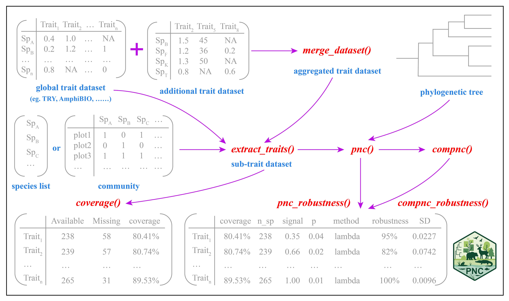

# PNC

The PNC package is an open-source, all-in-one solution for empirically testing the key assumption of phylogenetic niche conservatism (PNC) in ecological community studies. Designed for accessibility and scientific rigor, PNC streamlines the entire workflow---from integrating comprehensive, global trait databases (covering plants, birds, mammals, reptiles, amphibians, and fish) to assessing data quality, performing dimensionality reduction, and batch processing analyses.

By bridging a critical methodological gap, the PNC package enables robust, phylogenetically-informed ecology, biogeography, and conservation research---supporting more accurate predictions of species distributions, better assessments of global change risks, and stronger foundations for biodiversity conservation.

Get started with PNC to bring standardized, automated phylogenetic niche conservatism tests into your workflow!

## Installation

### From CRAN (recommended)

```{r,class.source = 'fold-show'}
# install.packages("PNC")
```

### From GitHub (development version)

```{r,class.source = 'fold-show'}
# if (!requireNamespace("devtools", quietly = TRUE)) {install.packages("devtools")}
# devtools::install_github("biodiversity-monitoring/PNC")
```

## Main functions of PNC and their descriptions

| Name                      | Type     | Description                                                                                                                                                                                                                                                                         |
|-------------|-------------|----------------------------------------------|
| **AmphiBIO**              | Database | A comprehensive global database of amphibian natural history traits. It provides 12 continuous traits related to ecology, morphology, and reproduction for over 6,500 species across all orders (Anura, Caudata, Gymnophiona), 61 families, and 531 genera (Oliveira et al., 2017). |
| **AVONET**                | Database | A comprehensive trait database for extant avian species, providing detailed morphological information through 11 continuous traits covering 11,009 bird species worldwide (Tobias et al., 2022).                                                                                    |
| **BCI**                   | Database | A 50-hectare forest ecosystem dataset from Barro Colorado Island, comprising comprehensive species inventories, phylogenetic trees at species and genus levels, and community composition matrices (Condit et al., 2019).                                                           |
| **COMBINE**               | Database | An integrated mammalian trait database consolidating 40 continuous morphological and ecological traits for 6,234 extant and recently extinct mammal species (Soria et al., 2021).                                                                                                   |
| **Fishlife**              | Database | A comprehensive compilation of life-history traits for described fish species (Chondrichthyes and Osteichthyes), featuring 17 continuous traits with at least one measurement for 26,622 species (Thorson et al., 2023).                                                            |
| **HimalayanBirds**        | Database | A dataset providing information on bird species in the Himalayas, including species names, phylogenetic relationships, and community composition across elevation bands (Ding et al., 2021).                                                                                        |
| **ReptTraits**            | Database | A comprehensive reptilian trait dataset comprising 8 continuous morphological and ecological traits across 12,060 species spanning major reptilian clades (Crocodylia, Testudines, Rhynchocephalia, Amphisbaenia, Sauria, and Serpentes) (Oskyrko et al., 2024).                    |
| **TRY**                   | Database | A global plant trait database providing species-level datasets with 20 continuous traits widely utilized in ecological and evolutionary research (Kattge et al., 2020).                                                                                                             |
| **`merge_dataset()`**     | function | Merges two data frames based on the "species" column, automatically handling missing values and inconsistent columns.                                                                                                                                                               |
| **`extract_traits()`**    | function | Extracts trait data at the species, genus, or family level from global trait databases.                                                                                                                                                                                             |
| **`coverage()`**          | function | Provides statistics on trait availability, including the number of missing values and coverage rates.                                                                                                                                                                               |
| **`pnc()`**               | function | Performs a phylogenetic niche conservatism analysis within a single community, quantifying the phylogenetic signal in trait data. Optional PCA dimensionality reduction and multiple statistical approaches are supported.                                                          |
| **`compnc()`**            | function | Conducts a comprehensive phylogenetic niche conservatism analysis across multiple communities, similar in function to `pnc()`.                                                                                                                                                      |
| **`pnc_robustness()`**    | function | Evaluates the robustness of phylogenetic signal estimates by simulating trait data and testing the consistency of statistical significance conclusions.                                                                                                                             |
| **`compnc_robustness()`** | function | Extends `pnc_robustness()` to evaluate the robustness of phylogenetic signal estimates across multiple communities.                                                                                                                                                                 |

## PNC workflow



### Study case 1

```{r,class.source = 'fold-show'}
library(PNC)

# Load dataset
data("BCI")
str(BCI)
data("TRY")
head(TRY)

## species level

# Extract species names
sp <- colnames(BCI$com)
sp

# Extract trait data for the specified species from the TRY database
subtraits <- extract_traits(sp, TRY, rank = "species", traits = c("LA", "LMA", "LeafN", "PlantHeight", "SeedMass", "SSD"))
head(subtraits)

# Calculate and display the coverage of the trait data
coverage(subtraits)

# Perform phylogenetic niche conservatism analysis using the pnc() function
pnc(subtraits, BCI$phy_species, methods = "lambda", pca_axes = c("PC1", "PC2"))

# Assess the robustness of the phylogenetic signal estimates
set.seed(123)
pnc_robustness(subtraits, BCI$phy_species, methods = "lambda", n_simulations = 100)

## genus level

# Extract genus names
sp2 <- unique(BCI$splist$genus)

# Extract trait data for the specified genera from the TRY database
subtraits2 <- extract_traits(sp2, TRY, rank = "genus", traits = c("LA", "LMA", "LeafN", "PlantHeight", "SeedMass", "SSD"))
head(subtraits2)

# Calculate and display the coverage of the trait data
coverage(subtraits2)

# Perform phylogenetic niche conservatism analysis
pnc(subtraits2, BCI$phy_genus, methods = "lambda", pca_axes = c("PC1", "PC2"))

# Assess the robustness of the phylogenetic signal estimates at the genus level
set.seed(123)
pnc_robustness(subtraits2, BCI$phy_genus, methods = "lambda", n_simulations = 100)
```

### Study case 2

```{r,class.source = 'fold-show'}
# Load dataset
data("HimalayanBirds")
str(HimalayanBirds)
data("AVONET")
head(AVONET)

# Extract species names
sp <- colnames(HimalayanBirds$com)
sp

# Extract trait data for the specified species from the AVONET database
subtraits <- extract_traits(sp, AVONET, rank = "species")
head(subtraits)

# Calculate and display the coverage of the trait data
coverage(subtraits)

# Perform phylogenetic niche conservatism analysis
pnc(subtraits, HimalayanBirds$phy_species, methods = "lambda", pca_axes = c("PC1", "PC2"))
set.seed(123)

# Assess the robustness of the phylogenetic signal estimates 
pnc_robustness(subtraits,
               HimalayanBirds$phy_species,
               methods = "lambda",
               pca_axes = c("PC1", "PC2"),
               n_simulations = 100)

# Perform phylogenetic niche conservatism analysis across multiple communities
compnc(com = HimalayanBirds$com, subtraits, HimalayanBirds$phy_species, methods = "lambda", pca_axes = NULL)

# Assess the robustness of phylogenetic signal estimates across multiple communities
set.seed(123)
robust_results <- compnc_robustness(HimalayanBirds$com,
                                    subtraits,
                                    HimalayanBirds$phy_species,
                                    methods = "lambda",
                                    pca_axes = c("PC1", "PC2"),
                                    n_simulations = 100)
robust_results
```

## Reference

Condit, R., Perez, R., Aguilar, S., Lao, S., Foster, R., Hubbell, S.P. (2019). Complete data from the Barro Colorado 50-ha plot: 423617 trees, 35 years, 2019 version. <https://doi.org/10.15146/5xcp-0d46>

Ding, Z., Hu, H., Cadotte, M.W., Liang, J., Hu, Y., & Si, X. (2021). Elevational patterns of bird functional and phylogenetic structure in the central Himalaya. Ecography, 44(9), 1403-1417. <https://doi.org/10.1111/ecog.05660>

Kattge, J., Bönisch, G., Díaz, S., Lavorel, S., Prentice, I. C., Leadley, P., Tautenhahn, S., Werner, G. D. A., Aakala, T., Abedi, M., Acosta, A. T. R., Adamidis, G. C., Adamson, K., Aiba, M., Albert, C. H., Alcántara, J. M., Alcázar C, C., Aleixo, I., Ali, H., Amiaud, B., et al. (2020). TRY plant trait database -- enhanced coverage and open access. Global Change Biology, 26(1), 43-60. <https://doi.org/10.1111/gcb.14904>

Oliveira, B. F., São-Pedro, V. A., Santos-Barrera, G., Penone, C., & Costa, G. C. (2017). AmphiBIO, a global database for amphibian ecological traits. Scientific data, 4(1), 1-7. <https://doi.org/10.1038/sdata.2017.123>

Oskyrko, O., Mi, C., Meiri, S., & Du, W. (2024). ReptTraits: a comprehensive dataset of ecological traits in reptiles. Scientific Data, 11(1), 243. <https://doi.org/10.1038/s41597-024-03079-5>

Soria, C. D., Pacifici, M., Di Marco, M., Stephen, S. M., & Rondinini, C. (2021). COMBINE: a coalesced mammal database of intrinsic and extrinsic traits. Ecology, 102(6), e03344. <https://doi.org/10.1002/ecy.3344>

Thorson, J. T., Maureaud, A. A., Frelat, R., Mérigot, B., Bigman, J. S., Friedman, S. T., Palomares, M. L. D., Pinsky, M. L., Price, S. A., & Wainwright, P. (2023). Identifying direct and indirect associations among traits by merging phylogenetic comparative methods and structural equation models. Methods in Ecology and Evolution, 14(5), 1243-1255. <https://doi.org/10.1111/2041-210X.14076>

Tobias, J. A., Sheard, C., Pigot, A. L., Devenish, A. J. M., Yang, J., Sayol, F., Neate-Clegg, M. H. C., Alioravainen, N., Weeks, T. L., Barber, R. A., Walkden, P. A., MacGregor, H. E. A., Jones, S. E. I., Vincent, C., Phillips, A. G., Marples, N. M., Montaño-Centellas, F. A., Leandro-Silva, V., Claramunt, S., Darski, B., et al. (2022). AVONET: morphological, ecological and geographical data for all birds. Ecology Letters, 25(3), 581-597. <https://doi.org/10.1111/ele.13898>
